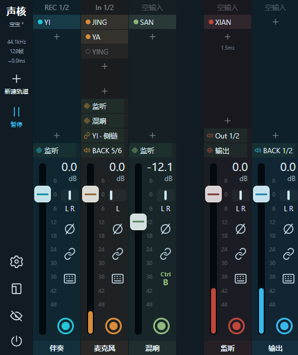
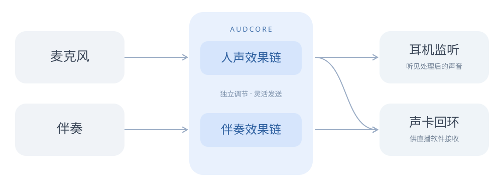

# 声核 audcore

### 小体积，高性能！声音，自由掌控。

声核是免费、轻巧的 Windows 实时调音台。连接音频设备，组合 VST3 效果器，让麦克风、伴奏和监听各走各的通道。支持 ASIO，适合直播、唱歌和实时监听。

[获取 Windows 版](https://audcore.utae.cn/download/) · [使用指北](docs/指北.md) · [更新记录](docs/更新记录.md) · [BUG 反馈与建议](https://github.com/itorr/audcore-document/issues)

## 小体积，高性能

专注实时音频处理，轻装常驻。以五条通道、十二个效果器的测试场景为例，启动约 87 毫秒，平均 CPU 占用约 0.5%，核心内存占用低于 16 MB。实际表现随设备、插件和参数而变化。

## 声音，自由掌控

每条通道可独立选择输入、安排效果链、发送与输出。麦克风和伴奏可以分别处理，再送往耳机监听或声卡回环。

## 实时监听

配合 ASIO 驱动实现低延迟监听。设备和效果器延迟会明确显示，也可以选择并行延迟对齐。收起控制台后，声核继续在托盘处理声音。

## 从这里开始

- [下载最新版](https://audcore.utae.cn/download/)：提供安装包和单文件版，页面附有文件 SHA-256。
- [阅读使用指北](docs/指北.md)：连接设备、添加效果器及排查常见问题。
- [查看更新记录](docs/更新记录.md)：了解各版本的用户可见变化。
- [提交 BUG 与建议](https://github.com/itorr/audcore-document/issues)：公开反馈统一在这里处理。

声核仍处于早期测试阶段。下载和运行前，请阅读[使用协议](https://audcore.utae.cn/guide/#agreement)。
